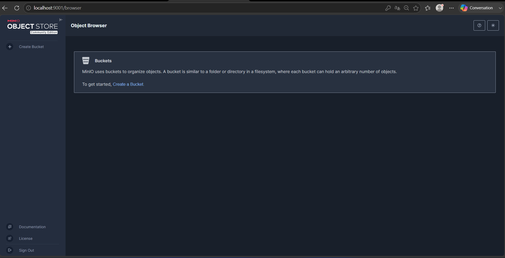
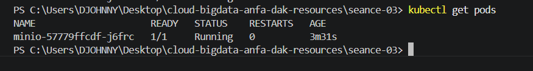
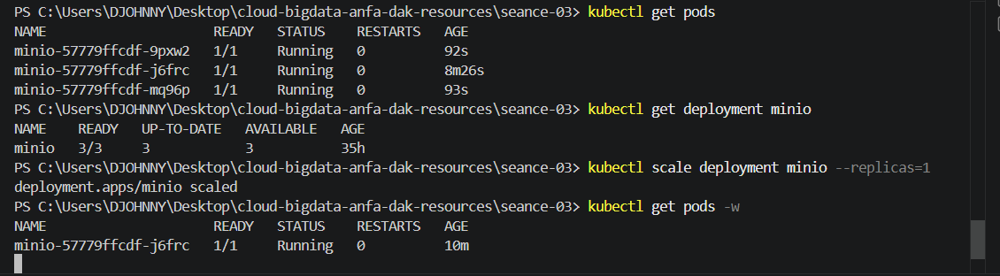

# Rendu - Séance 3

**Nom et prénom :** DAKOU Koudjo  
**Identifiant GitHub :** JohnnyDAK  
**Date de soumission :** 25/06/2026

---

## Résumé de la séance

J’ai installé **Kind** et **kubectl**, créé un cluster Kubernetes local nommé `anfa`, configuré un namespace dédié, puis déployé MinIO via 3 manifestes YAML (PVC, Deployment, Service). J’ai observé le **self-healing** en supprimant un pod et en voyant Kubernetes le recréer automatiquement, puis j’ai **scalé** le déploiement de 1 à 3 replicas. Enfin, j’ai activé l’**Ingress Controller** nginx pour préparer l’exposition des services.

---

## Étapes principales

1. Installation de **Kind** et **kubectl**, création du cluster `anfa`.
2. Création du namespace `anfa` et configuration de kubectl pour l’utiliser par défaut.
3. Déploiement de **MinIO** via 3 manifestes YAML :
   - `minio-pvc.yaml` (demande de stockage persistant)
   - `minio-deployment.yaml` (description du pod MinIO)
   - `minio-service.yaml` (exposition du service en NodePort)
4. Observation du **self-healing** : suppression manuelle d’un pod → recréation automatique par le Deployment.
5. **Scaling** du Deployment de 1 à 3 replicas, puis retour à 1 replica.
6. Activation de l’**Ingress Controller** nginx pour la gestion des entrées.

---

## Captures d’écran

### Console MinIO accessible via port-forward


### Self-healing observé


### Scaling à 3 replicas


---

## Réponses aux exercices d’application

### Exercice 1 – QCM conceptuel

**1.1 – B. Kubernetes orchestre des conteneurs sur un cluster de machines, en s'appuyant sur un container runtime (containerd, Docker, CRI-O).**  
*Justification :* Kubernetes ne remplace pas Docker, il utilise un container runtime pour exécuter les conteneurs et les orchestre sur plusieurs nœuds.

**1.2 – B. etcd**  
*Justification :* etcd est le stockage clé-valeur distribué qui conserve l’état complet du cluster (configuration, état des ressources, etc.).

**1.3 – C. Scheduler**  
*Justification :* Le Scheduler est responsable de l’affectation des pods aux nœuds en fonction des ressources disponibles et des contraintes définies.

**1.4 – C. À l’API Server, qui est le point d’entrée unique du cluster.**  
*Justification :* `kubectl` communique toujours avec l’API Server, qui est l’interface centrale de gestion du cluster.

**1.5 – B. Le Deployment recrée immédiatement un nouveau pod pour respecter l’état souhaité.**  
*Justification :* Le Deployment (via le ReplicaSet) détecte qu’il manque un pod et en recrée un automatiquement (self-healing).

**1.6 – B. NodePort**  
*Justification :* Un Service de type NodePort expose le service sur un port statique de chaque nœud, permettant un accès depuis l’extérieur sans load balancer cloud.

**1.7 – B. Elle modifie l’état souhaité du Deployment à 5 replicas ; Kubernetes converge vers ce nombre.**  
*Justification :* `kubectl scale` ajuste le nombre de replicas dans la définition du Deployment, et Kubernetes crée ou supprime des pods pour atteindre cet état.

**1.8 – B. À isoler logiquement les ressources (séparation par équipe, environnement, ou application).**  
*Justification :* Les namespaces permettent de partitionner un cluster en environnements virtuels isolés (ex: dev, prod, équipes).

**1.9 – B. Des conteneurs Docker.**  
*Justification :* Kind crée des nœuds Kubernetes sous forme de conteneurs Docker, ce qui permet d’exécuter K8s sans machines virtuelles lourdes.

---

### Exercice 2 – Lecture et interprétation d’un manifeste

**2.1 – Rôle de `selector.matchLabels` et lien avec `template.metadata.labels` :**  
- `selector.matchLabels` définit quels pods sont gérés par ce Deployment.  
- `template.metadata.labels` applique les labels aux pods créés par ce template.  
- Le lien : les labels du template doivent correspondre à ceux du selector pour que le Deployment puisse contrôler ces pods.

**2.2 – Nombre de pods et comportement en cas de mort :**  
- Le Deployment créera **2 replicas** (`replicas: 2`).  
- Si un pod meurt, le Deployment en recrée un nouveau automatiquement (self-healing).

**2.3 – Pourquoi `minio` et pas une IP :**  
- `minio` est le nom du Service Kubernetes qui expose MinIO.  
- La résolution est possible grâce au **DNS interne de Kubernetes** (CoreDNS), qui résout les noms de services en adresses IP cluster.

**2.4 – Conséquence de l’absence de Service :**  
- L’API n’est pas accessible depuis l’extérieur du pod.  
- Pas d’adresse réseau stable pour communiquer avec l’API ; les pods ne peuvent pas être découverts ni load-balancés.

**2.5 – Manifeste de Service (ClusterIP) :**
```yaml
apiVersion: v1
kind: Service
metadata:
  name: anfa-api
  namespace: anfa
spec:
  type: ClusterIP
  selector:
    app: anfa-api
  ports:
    - port: 80
      targetPort: 8000
Exercice 3 – Cas pratiques
3.1 – ImagePullBackOff

a. Le statut ImagePullBackOff signifie que Kubernetes ne parvient pas à tirer (pull) l’image du conteneur depuis le registre.

b. Cause probable : l’image minio/miniooo:latest n’existe pas (typo sur le nom).

c. Commande pour plus de détails :
kubectl describe pod <nom-du-pod>

3.2 – PVC en Pending

a. Pending signifie que le PVC est créé mais pas encore lié à un PersistentVolume.

b. Cause probable : dans un cluster Kind, le provisionneur local ne crée le volume que lorsqu’un pod monte le PVC. Le PVC reste en Pending tant qu’aucun pod ne l’utilise.

c. Pour confirmer :
kubectl describe pvc data-pvc
kubectl get storageclass

3.3 – Port-forward qui échoue

a. Le pod n’est pas en Running (statut Pending), donc aucun conteneur n’écoute sur le port 9001.

b. Pour comprendre :
kubectl describe pod <nom-du-pod>

c. Ordre logique :

Vérifier que le pod est en Running (kubectl get pods).
Vérifier que le service existe (kubectl get svc).
Ensuite seulement lancer kubectl port-forward.
Exercice 4 – De Docker Compose à Kubernetes
4.1 – Manifestes nécessaires pour reproduire le service Compose :

PVC : pour le stockage persistant.

Deployment : pour gérer le pod MinIO (replicas, image, env, volume).

Service : pour exposer MinIO sur le réseau (NodePort ou ClusterIP).

(Facultatif) Secret : pour les identifiants (bonne pratique).

4.2 – Différence conceptuelle entre volume Docker et PVC Kubernetes :

Un volume Docker nommé est une abstraction locale au nœud, gérée par Docker.

Un PVC Kubernetes est une demande de stockage indépendante du nœud, qui peut être liée à un PersistentVolume provisionné par le cluster (local, cloud, NFS, etc.). Le PVC est portable et survit aux redémarrages de pods.

4.3 – Pourquoi le port-forward est nécessaire avec Kind :

Avec Kind, les nœuds sont des conteneurs Docker. Les ports NodePort ne sont pas exposés sur l’hôte directement.

kubectl port-forward crée un tunnel entre le port local et le service dans le cluster.

Pour un accès direct, il faudrait soit utiliser un cloud provider avec LoadBalancer, soit configurer Kind avec un extraPortMapping dans le fichier de configuration.

4.4 – Deux apports de Kubernetes par rapport à Docker Compose (observés en TP) :

Self-healing : suppression d’un pod → recréation automatique.

Scaling : passage de 1 à 3 replicas en une commande (kubectl scale).

Exercice 5 – Mini-cas d’architecture
5.1 – Choix des objets Kubernetes :

pipeline-anfa : CronJob – s’exécute chaque nuit à 2h du matin (tâche planifiée).

anfa-api : Deployment – application REST sans état, doit être toujours disponible et scalable.

anfa-dashboard : Deployment – application web standard, consultée en journée.

5.2 – Paramètres pour l’Horizontal Pod Autoscaler (HPA) :

minReplicas: 3 (pour gérer le trafic minimal).

maxReplicas: 10 (pour les pics de charge).

Métrique cible : CPU utilisation à 60-70% (ou requêtes par seconde).

Justification : le trafic varie fortement entre les heures de pointe et le reste de la journée ; l’HPA ajuste automatiquement le nombre de pods.

5.3 – Type de Service pour anfa-api :

LoadBalancer (ou Ingress).

Justification : l’API doit être accessible depuis l’extérieur du cluster (applications mobiles). Un LoadBalancer fournit une IP publique stable.

5.4 – Gestion des mises à jour sans coupure :

Kubernetes utilise les Rolling Updates.

Par défaut, il remplace progressivement les anciens pods par les nouveaux, en maintenant un nombre minimum de pods disponibles.

Cela évite une coupure totale de service pendant le redéploiement.

5.5 – Squelette du manifeste Deployment pour anfa-api :

yaml
apiVersion: apps/v1
kind: Deployment
metadata:
  name: anfa-api
  namespace: anfa
spec:
  replicas: 3
  selector:
    matchLabels:
      app: anfa-api
  template:
    metadata:
      labels:
        app: anfa-api
    spec:
      containers:
        - name: api
          image: anfa/api:v1
          ports:
            - containerPort: 8000
          env:
            - name: MINIO_ENDPOINT
              value: "http://minio:9000"
Difficultés rencontrées
Problème d’installation de Kind sous Windows : après l’installation via winget, la commande kind n’était pas reconnue immédiatement. J’ai dû redémarrer PowerShell pour que le nouveau PATH soit pris en compte.

Kind ne parvenait pas à se connecter à Docker : Docker Desktop n’était pas démarré. J’ai lancé Docker Desktop et vérifié avec docker info avant de réessayer la création du cluster.

PVC en Pending : j’ai compris qu’avec Kind, le provisionnement du volume est différé jusqu’au lancement du Pod, ce qui est normal.

Fichier minio-deployment.yaml manquant : j’ai dû le créer manuellement avec la bonne indentation YAML.

Erreur resource name may not be empty sur le Service : le champ metadata.name n’était pas correctement indenté. J’ai corrigé l’indentation et réappliqué le manifeste.

kubectl wait sur l’Ingress Controller : le téléchargement de l’image a pris plus de 5 minutes, j’ai relancé la commande après avoir vérifié que le pod était en ContainerCreating puis en Running.

