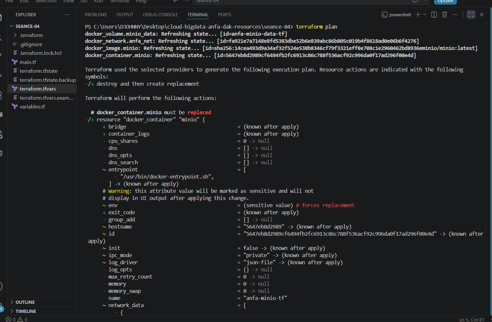
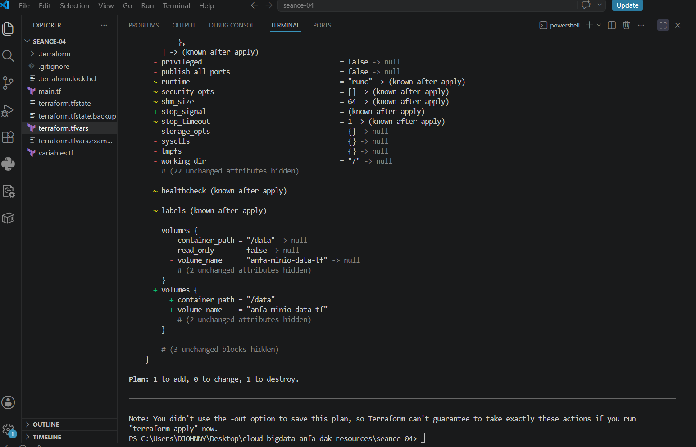
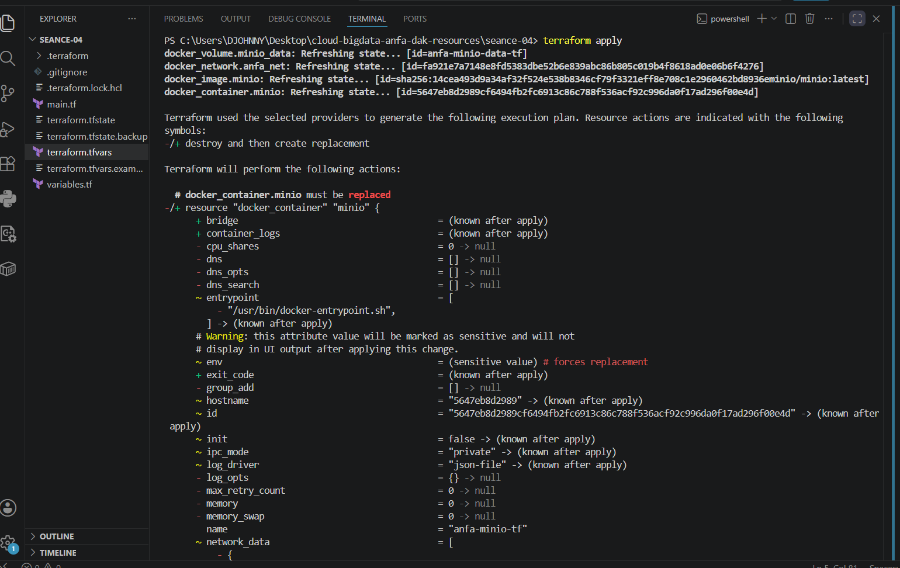
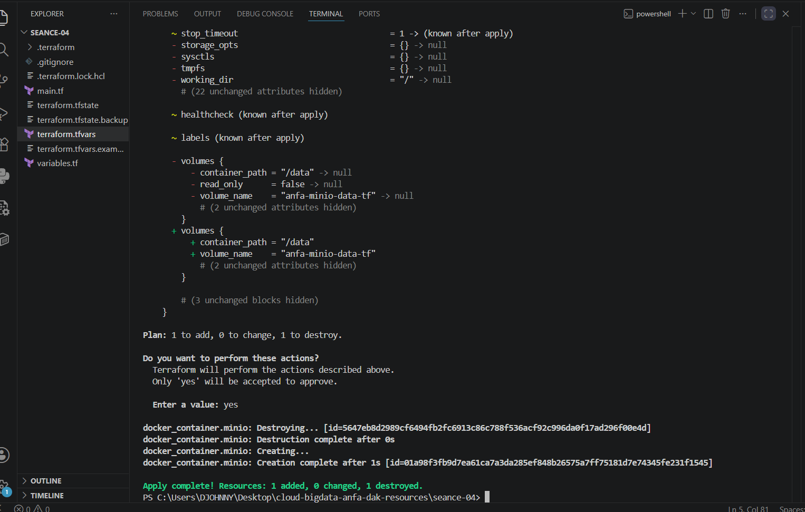
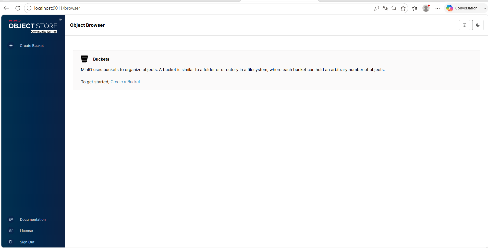
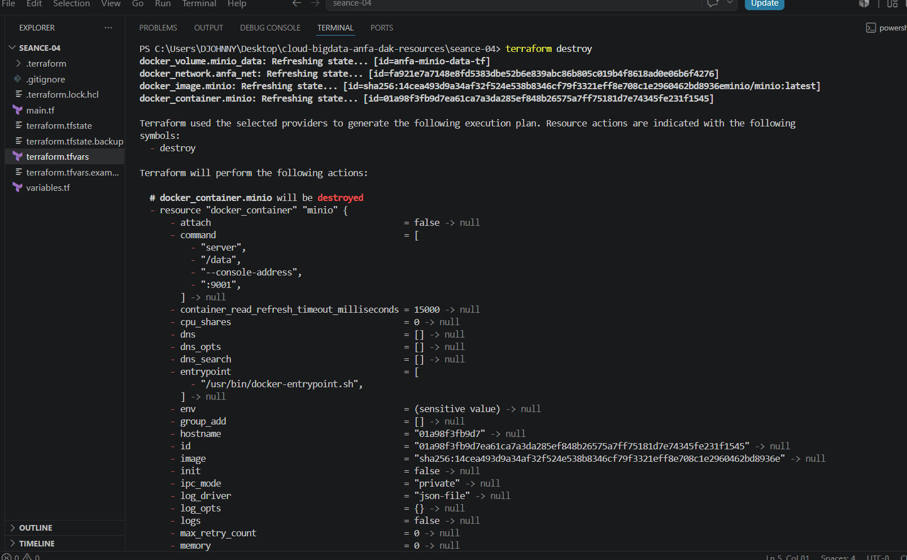
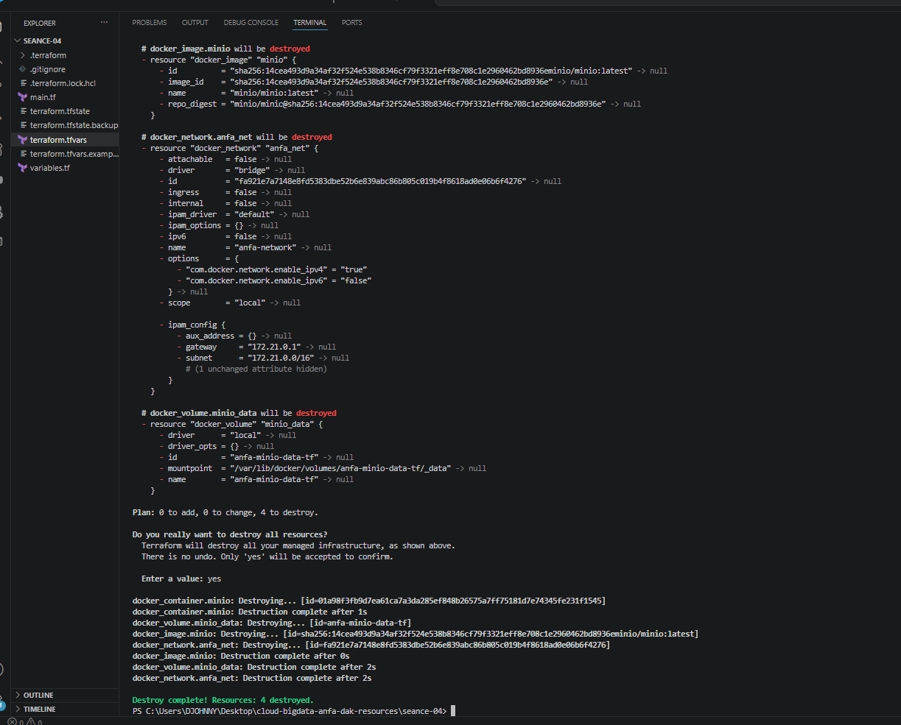

# Rendu - Séance 4

**Nom et prénom :** DAKOU Koudjo 
**Identifiant GitHub :** JohnnyDAK  
**Date de soumission :** 29/06/2026

---

## Résumé de la séance

J’ai installé Terraform, décrit une infrastructure Docker complète en HCL (réseau, volume, conteneur MinIO), maîtrisé le workflow `init` → `plan` → `apply` → `destroy`, compris le rôle du state et les bonnes pratiques de versioning, puis paramétré mon code avec des variables.

---

## Étapes principales

1. Installation de Terraform et premier `main.tf` minimal.
2. Maîtrise du workflow `init` → `plan` → `apply` → `destroy`.
3. Compréhension du state Terraform et bonnes pratiques de versioning (`.gitignore`).
4. Stack complète : réseau, volume, conteneur MinIO.
5. Refactoring en variables et fichier `.tfvars`.

---

## Captures d'écran

### terraform plan (création initiale)

### terraform apply réussi

### Console MinIO créée par Terraform

### terraform destroy

---

## Réponses aux exercices d'application

Exercice 1 – QCM conceptuel
1.1 – B. L'IaC remplace totalement la nécessité de comprendre l'infrastructure sous-jacente.
Justification : L'IaC ne remplace pas la compréhension de l'infrastructure ; elle la formalise. Il faut toujours comprendre ce qu'on déploie pour diagnostiquer et maintenir.

1.2 – B. Le déclaratif décrit l'état souhaité ; l'impératif décrit la séquence d'actions à effectuer.
Justification : Terraform est déclaratif : on décrit l'état final, il calcule les actions. Un script bash est impératif : on décrit chaque étape.

1.3 – B. Elle produit le même résultat quel que soit le nombre de fois où elle est appliquée.
Justification : L'idempotence garantit qu'on peut réappliquer la configuration sans effet de bord. C'est le cœur de Terraform.

1.4 – B. À fournir un plugin qui sait communiquer avec une API spécifique (AWS, Docker, Kubernetes…).
Justification : Le provider est l'interface entre Terraform et le système cible (Docker, AWS, etc.).

1.5 – B. Terraform compare le state au code, ne voit aucun écart, et n'effectue aucune action.
Justification : C'est l'idempotence : l'état réel correspond à l'état souhaité, donc rien à faire.

1.6 – C. Mémoriser ce que Terraform a créé pour pouvoir suivre les changements incrémentaux.
Justification : Le state est le "cerveau" de Terraform ; il permet de calculer les différences entre le code et l'infrastructure existante.

1.7 – B. Parce qu'il peut contenir des secrets en clair (mots de passe, clés API) et peut être corrompu par des commits concurrents.
Justification : Le state contient des données sensibles (ex: mot de passe MinIO) et les conflits de merge sont impossibles à résoudre.

1.8 – C. terraform plan
Justification : terraform plan est la commande qui prévisualise les changements avant de les appliquer. C'est le réflexe fondamental.

1.9 – B. Un fork open source de Terraform créé après le changement de licence de HashiCorp en 2023.
Justification : OpenTofu est né de la communauté pour garantir une alternative open source après le passage de Terraform en licence BSL.

1.10 – B. Non, Terraform provisionne l'infrastructure, Ansible configure des machines existantes — ils sont complémentaires.
Justification : Terraform crée l'infrastructure (VMs, réseaux), Ansible la configure (installer des logiciels, configurer des services). Ils sont souvent utilisés ensemble.

Exercice 2 – Lecture et interprétation d'un fichier Terraform
2.1 – Liste des 4 resources et leurs rôles :

Resource	Type	Rôle
docker_network.back	Réseau	Crée un réseau Docker nommé anfa-backend pour la communication entre conteneurs.
docker_volume.data	Volume	Crée un volume persistant postgres-data pour stocker les données PostgreSQL.
docker_image.postgres	Image	Télécharge l'image Docker postgres:15 pour l'utiliser dans le conteneur.
docker_container.db	Conteneur	Crée un conteneur PostgreSQL nommé anfa-postgres avec ses configurations (ports, env, volume).
2.2 – Signification de docker_image.postgres.image_id :

docker_image.postgres est une référence à la resource docker_image nommée postgres.

.image_id est l'attribut qui contient l'ID de l'image après son téléchargement (ex: sha256:abc123...).

Apport : Terraform crée une dépendance implicite : il télécharge d'abord l'image, puis utilise son ID exact pour créer le conteneur. En écrivant directement image = "postgres:15", Terraform n'aurait pas cette dépendance explicite et pourrait créer le conteneur avant que l'image soit téléchargée (erreur potentielle).

2.3 – Ordre de création lors du premier terraform apply :
Terraform crée dans cet ordre :

docker_network.back – pas de dépendance.

docker_volume.data – pas de dépendance.

docker_image.postgres – pas de dépendance.

docker_container.db – en dernier, car il dépend des 3 ressources précédentes (réseau, volume, image).

Pourquoi : Terraform analyse automatiquement les références entre ressources (ex: docker_image.postgres.image_id, docker_volume.data.name). Il construit un graphe de dépendances et crée les ressources dans l'ordre : d'abord les dépendances, puis les dépendants.

2.4 – Problème de sécurité principal :
Le mot de passe PostgreSQL secret123 est écrit en clair dans le code (POSTGRES_PASSWORD=secret123). C'est un secret qui sera versionné dans Git et exposé à tous.

Correction concrète :

hcl
# variables.tf
variable "db_password" {
  description = "Mot de passe PostgreSQL"
  type        = string
  sensitive   = true
}

# main.tf - dans la resource docker_container.db
env = [
  "POSTGRES_DB=anfa",
  "POSTGRES_USER=anfa_user",
  "POSTGRES_PASSWORD=${var.db_password}",
]

# terraform.tfvars (non versionné)
db_password = "un-mot-de-passe-securise"
2.5 – Que fait Terraform après destroy puis modification du port ?
Après terraform destroy, l'infrastructure a été supprimée. Le state est vide.
Quand l'étudiant modifie external = 5432 en external = 5433 et relance terraform apply, Terraform :

Crée un nouveau conteneur avec le nouveau port 5433 (car il n'y a plus d'ancien conteneur).

Le state est mis à jour.

Justification : Puisque destroy a tout supprimé, il n'y a pas de "modification" à faire. Terraform voit une infrastructure vide et la recrée entièrement.

Exercice 3 – Cas pratiques
3.1 – Dépendance circulaire

a. Que signifie l'erreur Cycle: docker_container.a, docker_container.b ?
Terraform a détecté une boucle de dépendances : container-a dépend de container-b (via LINKED_TO=${docker_container.b.name}) et container-b dépend de container-a (via LINKED_TO=${docker_container.a.name}). Terraform ne peut pas déterminer quel conteneur créer en premier.

b. Pourquoi Terraform refuse-t-il d'appliquer ce code ?
Parce qu'il est impossible de créer a sans b (puisque a a besoin du nom de b), et impossible de créer b sans a (puisque b a besoin du nom de a). C'est un problème de résolution.

c. Comment résoudre ce problème ?
Utiliser un nom fixe pour les conteneurs au lieu d'une interpolation mutuelle :

hcl
resource "docker_container" "a" {
  name  = "container-a"
  image = "alpine"
  env   = ["LINKED_TO=container-b"]   # ← nom fixe
}

resource "docker_container" "b" {
  name  = "container-b"
  image = "alpine"
  env   = ["LINKED_TO=container-a"]   # ← nom fixe
}
Ainsi, les noms sont connus à l'avance et ne dépendent pas l'un de l'autre. On peut aussi utiliser un depends_on explicite, mais c'est généralement une mauvaise pratique.

3.2 – Le plan qui veut tout recréer

a. Pourquoi Terraform marque-t-il le conteneur avec -/+ (remplacer) plutôt que ~ (modifier) ?
Dans le provider Docker, la variable env est une liste. Quand on modifie une valeur dans la liste, Docker ne permet pas de modifier l'environnement d'un conteneur en cours d'exécution. Terraform doit donc supprimer l'ancien conteneur et en créer un nouveau avec la nouvelle variable d'environnement. -/+ signifie "détruire puis recréer".

b. Les données seront-elles perdues lors de cette recréation ?
Non, si le conteneur utilise un volume persistant (déclaré avec volumes { ... }). Le volume est attaché au nouveau conteneur, donc les données sont conservées. Seul le conteneur est recréé, pas le volume.

c. Cette recréation est-elle gratuite en production ?
Non. En production, cette opération entraîne :

Un temps d'arrêt (coupure de service) pendant la suppression et la recréation.

Une perte de l'IP du conteneur (si elle n'est pas gérée par un service).

Un risque si la recréation échoue (le nouveau conteneur ne démarre pas, l'ancien est déjà supprimé).
C'est pourquoi il faut tester en staging et utiliser des stratégies de déploiement sans interruption (ex: blue-green).

3.3 – Le state corrompu

a. Quel problème de sécurité immédiat ?
Le fichier terraform.tfstate contient des secrets en clair (ex: POSTGRES_PASSWORD=secret123, MINIO_ROOT_PASSWORD). En le poussant sur GitHub, n'importe qui peut voir ces mots de passe.

b. Quel risque technique quand Awa applique Terraform avec ce state ?
Awa et l'étudiant ont chacun leur propre state, mais ils partagent le même code. Si Awa applique avec un state qui ne correspond pas à son infrastructure réelle, Terraform peut :

Supprimer des ressources par erreur (car le state dit qu'elles existent, alors qu'elles n'existent pas).

Créer des doublons de ressources.

Générer des conflits irréversibles.

c. Solution pérenne pour éviter ce problème :
Utiliser un remote backend (ex: Terraform Cloud, S3, GCS, etc.) pour stocker le state de manière centralisée et sécurisée. Le state est partagé entre les membres de l'équipe, qui appliquent tous sur le même state.

Exemple avec S3 :

hcl
backend "s3" {
  bucket = "anfa-terraform-state"
  key    = "anfa/terraform.tfstate"
  region = "eu-west-3"
}
Activer le verrouillage du state (DynamoDB pour S3) pour éviter les modifications concurrentes.

Exercice 4 – Adaptation Compose → Terraform
Voici un squelette Terraform complet qui traduit le docker-compose.yml en respectant les bonnes pratiques :

hcl
# variables.tf
variable "minio_root_password" {
  description = "Mot de passe root MinIO"
  type        = string
  sensitive   = true
}

variable "jupyter_token" {
  description = "Token Jupyter"
  type        = string
  default     = "anfa-token"
}

# main.tf
terraform {
  required_providers {
    docker = {
      source  = "kreuzwerker/docker"
      version = "~> 3.0"
    }
  }
}

provider "docker" {}

# 1. Réseau partagé (équivalent du réseau implicite de Compose)
resource "docker_network" "anfa_net" {
  name = "anfa-network"
}

# 2. Volume pour MinIO
resource "docker_volume" "minio_data" {
  name = "minio-data"
}

# 3. Image MinIO
resource "docker_image" "minio" {
  name = "minio/minio:latest"
}

# 4. Conteneur MinIO
resource "docker_container" "minio" {
  name  = "anfa-minio"
  image = docker_image.minio.image_id

  command = ["server", "/data", "--console-address", ":9001"]
  restart = "unless-stopped"

  ports {
    internal = 9000
    external = 9000
  }
  ports {
    internal = 9001
    external = 9001
  }

  env = [
    "MINIO_ROOT_USER=anfa-admin",
    "MINIO_ROOT_PASSWORD=${var.minio_root_password}",   # ← secret en variable
  ]

  volumes {
    volume_name    = docker_volume.minio_data.name
    container_path = "/data"
  }

  networks_advanced {
    name = docker_network.anfa_net.name
  }

  lifecycle {
    ignore_changes = [log_opts]
  }
}

# 5. Image Jupyter
resource "docker_image" "jupyter" {
  name = "jupyter/scipy-notebook:latest"
}

# 6. Conteneur Jupyter
resource "docker_container" "jupyter" {
  name  = "anfa-jupyter"
  image = docker_image.jupyter.image_id

  restart = "unless-stopped"

  ports {
    internal = 8888
    external = 8888
  }

  env = [
    "JUPYTER_TOKEN=${var.jupyter_token}"
  ]

  networks_advanced {
    name = docker_network.anfa_net.name
  }

  # Terraform gère automatiquement la dépendance vers le réseau
  # Pas besoin de depends_on, la référence au réseau suffit.

  lifecycle {
    ignore_changes = [log_opts]
  }
}
Fichier terraform.tfvars (non versionné) :

hcl
minio_root_password = "anfa-password-2026"
# jupyter_token = "anfa-token"  # optionnel
Fichier terraform.tfvars.example (versionné) :

hcl
# Exemple de configuration
# minio_root_password = "changez-moi"
# jupyter_token       = "anfa-token"
Exercice 5 – Mini-cas d'architecture
5.1 – Types de ressources Terraform à créer dans le cloud OVHcloud :

Un bucket de stockage objet (S3 compatible) – pour stocker les CSV, logs GPS, et données brutes.

Un cluster Kubernetes managé (OVH Managed Kubernetes) – pour orchestrer les conteneurs.

Un load balancer (ou service de type LoadBalancer) – pour exposer le dashboard Grafana publiquement.

Un volume persistant (PV/PVC) – pour les données des applications stateful (ex: base de données).

Un réseau privé virtuel (VPC) – pour isoler les ressources entre elles.

Une base de données managée (PostgreSQL) – pour stocker les métadonnées.

5.2 – Organisation des fichiers Terraform :
Je recommande l'approche B : plusieurs fichiers séparés (network.tf, storage.tf, compute.tf, monitoring.tf).

Justification :
Un fichier unique de 800 lignes devient vite illisible et difficile à maintenir. La séparation par couche ou par domaine facilite :

La relecture (code review) : chacun peut se concentrer sur une partie.

Le débogage : on sait où chercher l'erreur.

La réutilisation : on peut importer un module spécifique.

Le travail collaboratif : moins de conflits Git.

C'est une pratique standard en équipe (ex: modules Terraform).

5.3 – Mécanismes pour gérer plusieurs environnements (dev/prod) :

terraform.tfvars différents :

terraform.dev.tfvars pour dev, terraform.prod.tfvars pour prod.

Appliquer avec terraform apply -var-file=terraform.dev.tfvars.

Workspaces :
terraform workspace new dev puis terraform workspace new prod. Chaque workspace a son propre state, permettant des valeurs différentes pour les variables.

Variables d'environnement :
Utiliser TF_VAR_<nom> pour surcharger les variables depuis le shell (ex: TF_VAR_cluster_size=3).

5.4 – Migration OVHcloud → AWS :
La migration n'est pas triviale. Voici ce qui se transpose facilement et ce qui demandera du travail :

✅ Ce qui se transpose facilement :

La logique métier (conteneurs Docker, scripts Python) reste inchangée.

La structure IaC (organisation des fichiers, modules) est réutilisable.

❌ Ce qui demandera du travail :

Les providers : il faut remplacer le provider OVHcloud par le provider AWS, ce qui implique de réécrire toutes les ressources (buckets S3, clusters EKS, etc.).

Les noms des ressources et leur API sont différents.

Les réseaux (VPC OVH vs VPC AWS) sont incompatibles.

Les identifiants (credentials) doivent être recréés.

Temps estimé : plusieurs semaines, voire mois, selon la complexité de l'infrastructure.

5.5 – 3 bonnes pratiques pour une équipe de 4 développeurs :

Utiliser un remote backend (ex: OVHcloud S3) pour partager le state en sécurité, avec verrouillage pour éviter les conflits.

Versionner les fichiers .tfvars.example et exclure les vrais .tfvars du Git (via .gitignore) pour éviter les fuites de secrets.

Mettre en place des revues de code systématiques avant toute fusion dans main, avec des vérifications via terraform fmt et terraform validate dans la CI/CD.

Utiliser des modules pour factoriser le code réutilisable (ex: module "minio", module "jupyter") et réduire la duplication.

Définir une convention de nommage claire pour les ressources (ex: ${var.environment}-${var.project}-${resource_type}) pour éviter les collisions.

## Difficultés rencontrées

Aucune difficulté majeure