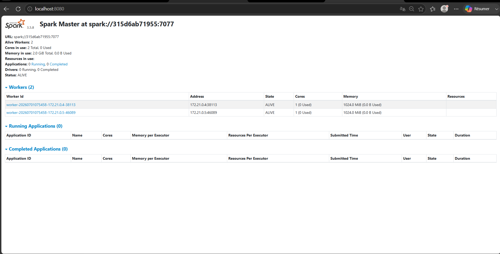
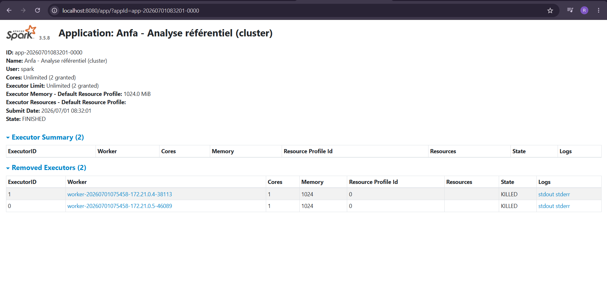
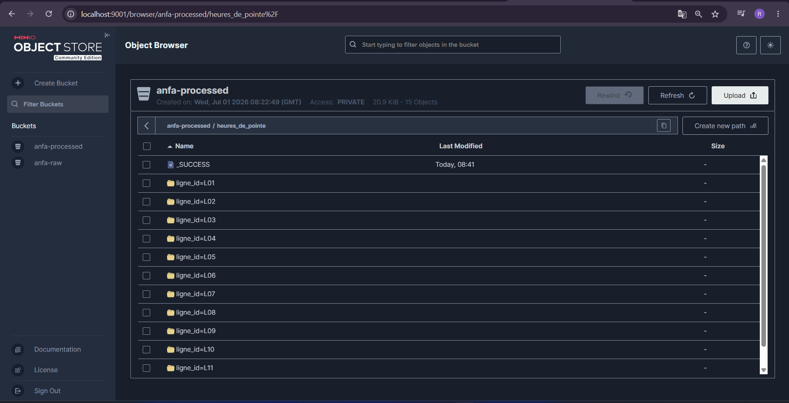
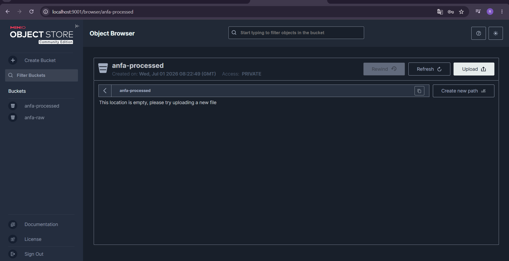

# Rendu - Séance 5

**Nom et prénom :** DAKOU Koudjo  
**Identifiant GitHub :** JohnnyDak 
**Date de soumission :** 30/06/2026

---

## Résumé de la séance

J’ai déployé un cluster Spark standalone (1 master + 2 workers) via Docker Compose, puis soumis des jobs PySpark distribués qui lisent le référentiel d’Anfa depuis MinIO via le connecteur S3A. Les résultats ont été écrits en Parquet dans le bucket `anfa-processed`. J’ai également généré un historique simulé de trajets et calculé les heures de pointe par ligne, avec un partitionnement par `ligne_id`. J’ai comparé subjectivement le mode local et le mode cluster.

---

## Étapes principales

1. Déploiement du cluster Spark standalone (1 master + 2 workers) via Docker Compose.
2. Préparation de MinIO : création des buckets `anfa-raw` et `anfa-processed`, upload du référentiel CSV.
3. Premier job distribué (`analyse_referentiel_cluster.py`) : statistiques de base sur le référentiel.
4. Génération d’un historique simulé de trajets (30 jours, ~75 000 trajets) avec `generer_trajets.py`.
5. Job d’analyse des heures de pointe (`heures_de_pointe.py`) : groupBy par ligne et heure, écriture en Parquet partitionné.
6. Observation des exécutions dans l’UI Spark Master (http://localhost:8080).
7. Comparaison subjective entre mode local et mode cluster.

---

## Captures d’écran

### Dashboard Spark Master avec 2 workers

### Application Spark exécutée avec succès

### Résultats du Top 10 des heures de pointe dans la console

### Bucket `anfa-processed` avec `heures_de_pointe` partitionné

---

## Réflexion : local vs cluster

**Mes observations :**
- Le mode local (séance 2) était plus réactif sur de petits volumes (< 100 000 lignes). L’exécution était quasi instantanée.
- Le mode cluster (séance 5) a montré un léger overhead (communication entre master et workers), mais la montée en charge est possible.
- Je choisirais le **mode local** pour du développement, des tests, ou des traitements ponctuels sur des données de petite taille.
- Je choisirais le **mode cluster** pour des traitements en production, sur des volumes importants (plusieurs millions de lignes), ou quand la mémoire d’une seule machine est insuffisante.

---

## Bonus Spark sur Kubernetes

Non réalisé

---

## Réponses aux exercices d'application

Exercice non fourni

---

## Difficultés rencontrées

- Problème d’authentification avec les clés `anfa-app-key` / `anfa-app-secret-2026` : j’ai utilisé les identifiants root `anfa-admin` / `anfa-password-2026` à la place, dans tous les scripts (upload, génération des trajets, jobs Spark).
- Adaptation des commandes pour PowerShell (utilisation des backticks pour la continuation de ligne, remplacement de `$()` par `$(pwd)` / `$PWD`).
- Premier téléchargement des packages Maven `hadoop-aws` long (~2-4 minutes) ; les exécutions suivantes sont plus rapides grâce au cache.

---

