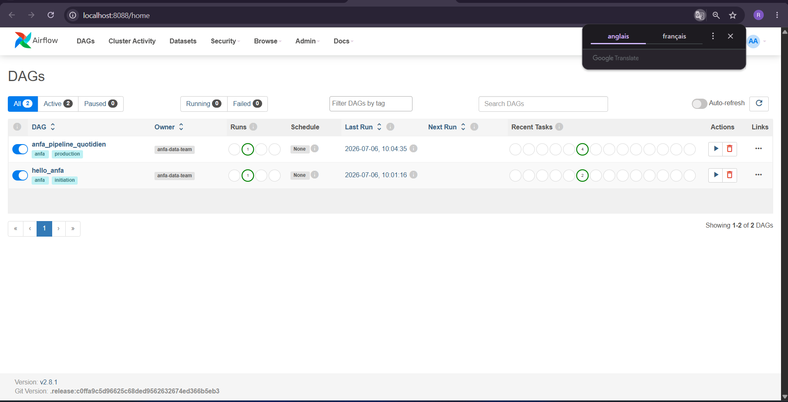
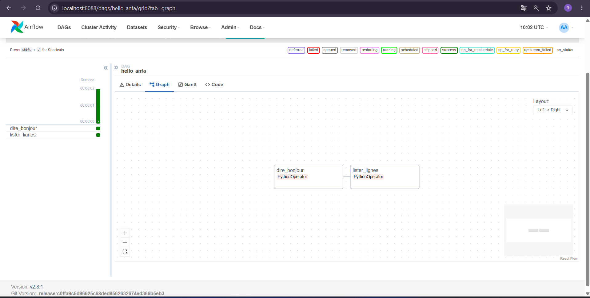
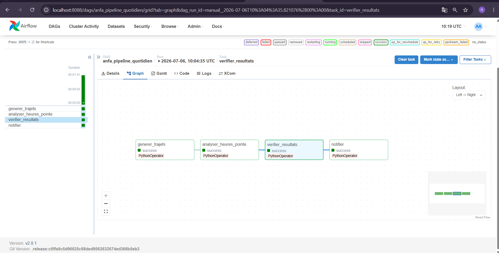
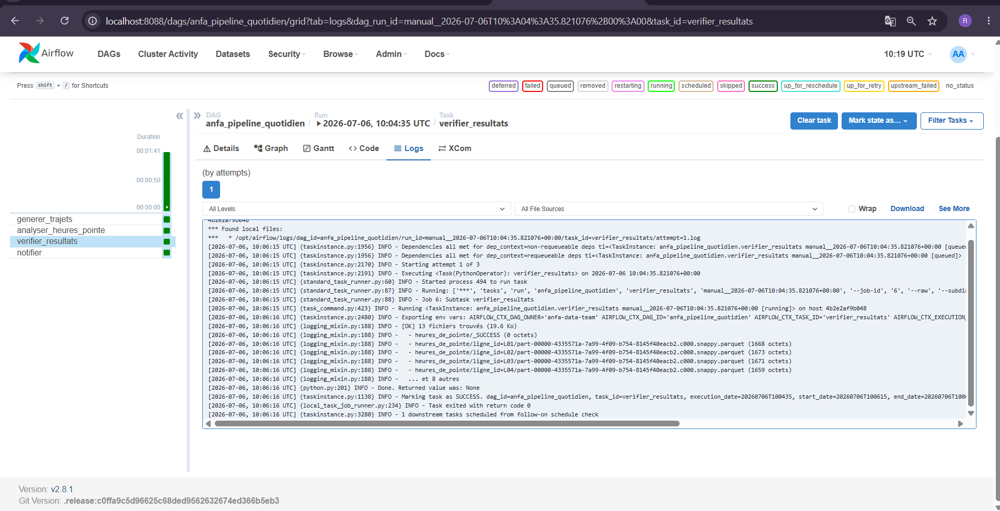
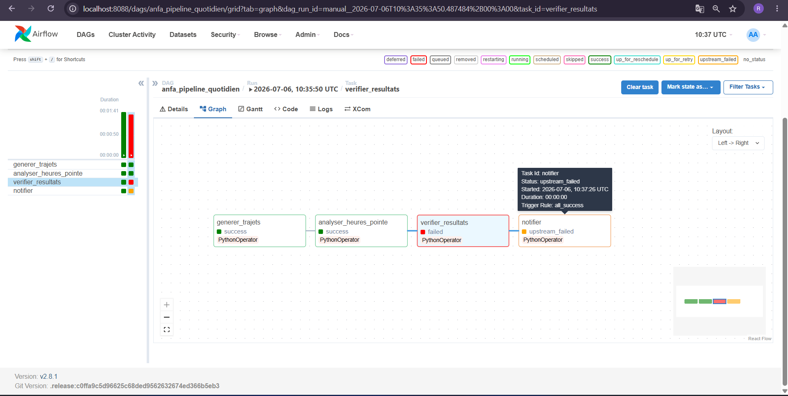

# Rendu : Séance 6

**Nom et prénom :** DAKOU Koudjo  
**Identifiant GitHub :** JohnnyDak  
**Date de soumission :** 30/06/2026

---

## Résumé de la séance

Airflow déployé via Docker Compose aux côtés de MinIO et Spark. Un premier DAG
simple (`hello_anfa`) a servi à comprendre la mécanique, puis un DAG métier
(`anfa_pipeline_quotidien`) orchestre le pipeline de la séance 5 :
génération → analyse Spark → vérification → notification. Les retries et la
propagation d'échec ont été observés via un bug volontaire.

---

## Étapes principales

1. Déploiement de la stack (Airflow + PostgreSQL + MinIO + Spark) via Docker Compose.
2. Premier DAG `hello_anfa` à 2 tâches : initiation à la mécanique Airflow.
3. DAG métier `anfa_pipeline_quotidien` à 4 tâches : génération → Spark → vérification → notification.
4. Démonstration des retries et de la gestion d'erreur via un bug volontaire.

---

## Captures d'écran

### UI Airflow après connexion (vue d'accueil)

### DAG hello_anfa exécuté en succès

### DAG anfa_pipeline_quotidien complet en succès

### Logs de la tâche `verifier_resultats`

### Démonstration du retry : tâche en échec et propagation

---

## Réflexion personnelle

Airflow apporte bien plus qu'un simple cron : il offre une **visibilité complète** sur l'exécution des tâches (logs, historique, statut en temps réel), des **mécanismes de résilience** (retries automatiques, reprise après échec) et une **orchestration déclarative** permettant de définir des dépendances complexes entre tâches.

Sur un vrai projet, j'utiliserais Airflow pour tout pipeline qui dépasse une simple tâche cron : enchaînement de plusieurs étapes (extraction, transformation, chargement), avec monitoring, reprise sur échec, et notification. C'est indispensable quand les données sont critiques et que la rejouabilité est un besoin métier (ex: reprise d'historique).

---

## Difficultés rencontrées

- **PostgreSQL 18 incompatible avec les volumes existants** : l'image `postgres:18-alpine` refuse de démarrer si un volume de version antérieure existe. J'ai passé à `postgres:15-alpine` pour résoudre le problème proprement.
- **Identifiants MinIO** : les clés applicatives `anfa-app-key` / `anfa-app-secret-2026` n'étaient pas créées dans MinIO ; j'ai dû les configurer via `mc` (ou utiliser les identifiants root) pour que les scripts fonctionnent.
- **Logs de la tâche `verifier_resultats`** : ils n'apparaissaient pas au départ car la tâche était grisée (non exécutée suite à un échec des tâches amont). Une fois tout le pipeline vert, les logs sont devenus visibles.

---

**Fin du rendu.**