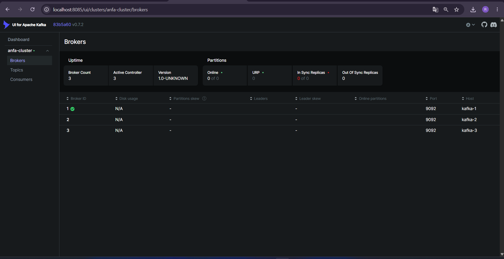
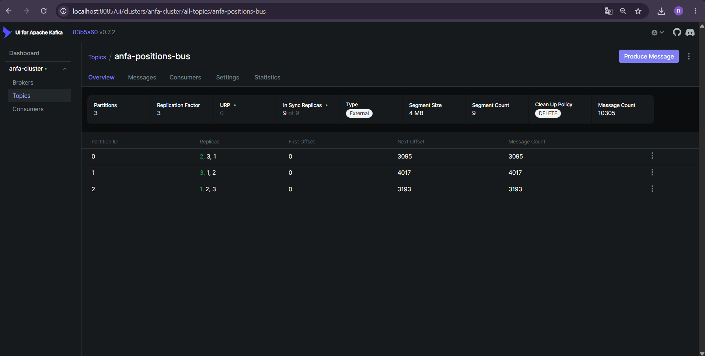
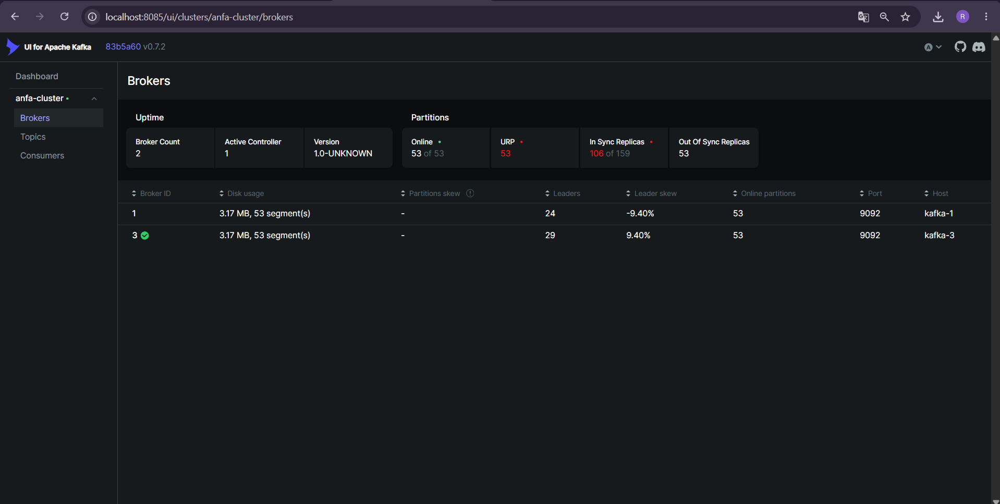
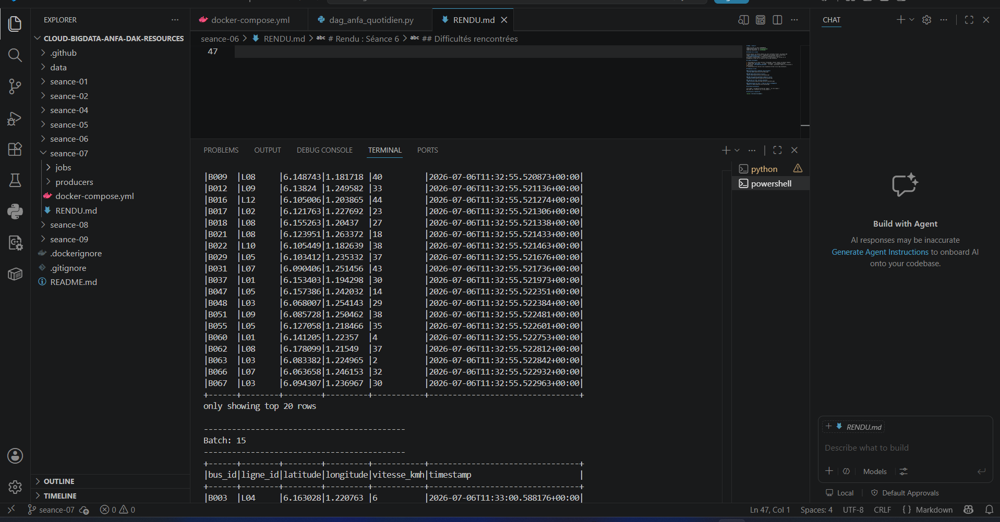
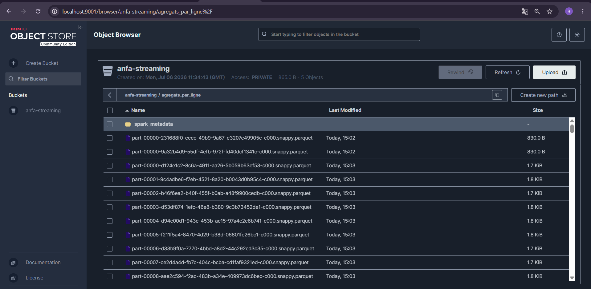

# Rendu : Séance 7

**Nom et prénom :** Denis AKPAGNONITE  
**Identifiant GitHub :** JohnnyDak  
**Date de soumission :** 06/07/2026

---

## Résumé de la séance

J’ai déployé un cluster Kafka à 3 brokers en mode KRAFT (sans Zookeeper), accompagné de Kafka UI. Un topic `anfa-positions-bus` a été créé avec 3 partitions et un facteur de réplication de 3. J’ai simulé une flotte de 100 bus Anfa envoyant leurs positions GPS en continu (~100 messages/seconde). J’ai observé la tolérance aux pannes en tuant volontairement un broker : le cluster a continué de fonctionner sans interruption. Enfin, j’ai consommé le flux avec Spark Structured Streaming, calculé des agrégats en fenêtres temporelles (30 secondes) par ligne, et écrit les résultats dans MinIO au format Parquet.

---

## Étapes principales

1. Déploiement du cluster Kafka (3 brokers, mode KRAFT) via Docker Compose.
2. Création du topic `anfa-positions-bus` (3 partitions, réplication 3).
3. Test du producer et consumer Python simples pour comprendre la mécanique.
4. Simulation de la flotte Anfa (100 bus, ~100 messages/seconde).
5. Démonstration de la tolérance aux pannes : kill d’un broker → survie du cluster.
6. Lecture du flux Kafka avec Spark Structured Streaming (affichage en console).
7. Agrégation en fenêtres temporelles (30 secondes) par ligne, écriture en Parquet dans MinIO.

---

## Captures d'écran

### 3 brokers actifs dans Kafka UI

### Débit de messages en augmentation

### 2 brokers actifs après le kill de `anfa-kafka-2`

### Micro-batches Spark en console

### Fichiers Parquet dans MinIO (`anfa-streaming/agregats_par_ligne/`)

---

## Réflexion personnelle

Ce TP m’a permis de mettre en œuvre un pipeline temps réel complet : ingestion des données dans Kafka, traitement avec Spark Structured Streaming, et stockage des résultats dans MinIO. La tolérance aux pannes de Kafka (réplication 3) est impressionnante : un broker peut tomber sans que le flux soit interrompu. Spark Streaming avec fenêtres temporelles est un outil puissant pour l’analyse en continu des données. Sur un vrai projet, ce pipeline serait utilisé pour surveiller en temps réel la flotte de bus, détecter des anomalies (retards, surcharge), et alerter les exploitants.

---

## Difficultés rencontrées

- **PostgreSQL 18 incompatible avec les volumes existants** : passage à `postgres:15-alpine` pour résoudre le problème.
- **Identifiants MinIO** : la clé `anfa-app-key` n’existait pas dans MinIO ; je l’ai recréée via `mc admin user svcacct add`.
- **Spark ne trouvait pas de ressources** : des applications Spark résiduelles (`app-20260706113148-0000`) bloquaient le worker. J’ai redémarré les conteneurs Spark (`anfa-spark-master` et `anfa-spark-worker`) pour réinitialiser le cluster.
- **Conflit de noms de conteneurs** : plusieurs conteneurs de séances précédentes utilisaient les mêmes noms (`anfa-spark-master`, `anfa-minio`). Je les ai supprimés avant de lancer la séance 7.

---

**Fin du rendu.**