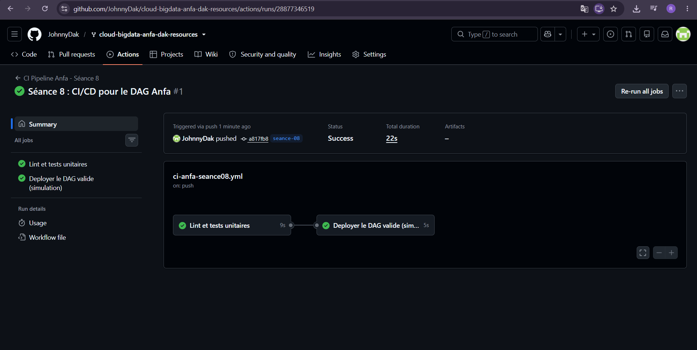
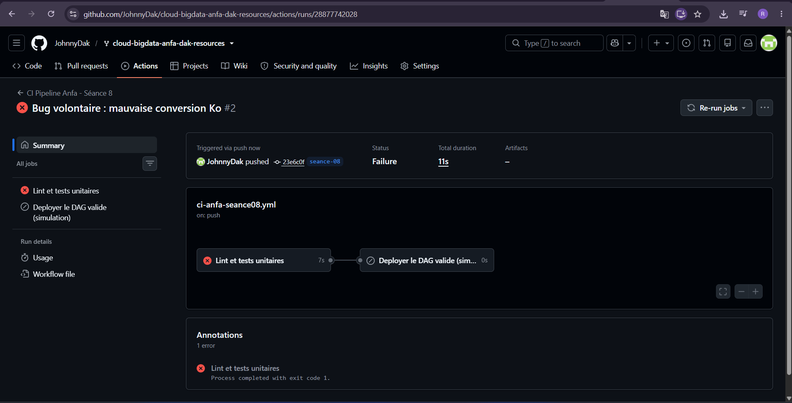

# Rendu — Séance 8

**Nom et prénom :** DAKOU Koudjou  
**Identifiant GitHub :** JohnnyDak  
**Date de soumission :** 07/07/2026 

---

## Résumé de la séance

J’ai séparé la logique métier du DAG Airflow (TP6) dans un module Python indépendant (`anfa_logic.py`), puis écrit 5 tests unitaires avec `pytest` pour valider son comportement. J’ai mis en place un pipeline CI/CD avec GitHub Actions qui exécute automatiquement le lint (`flake8`) et les tests à chaque `push` sur la branche `seance-08`. J’ai volontairement introduit un bug pour observer le pipeline bloquer le déploiement, puis corrigé le bug pour constater le succès du workflow.

---

## Étapes principales

1. Séparation de la logique métier (`anfa_logic.py`) du DAG Airflow (`dag_anfa_quotidien.py`).
2. Écriture de 5 tests unitaires avec `pytest` dans `tests/test_anfa_logic.py`.
3. Écriture du workflow GitHub Actions (`.github/workflows/ci-anfa-seance08.yml`) avec 2 jobs :
   - `valider-dag` : lint + tests unitaires.
   - `deployer` : simulation de déploiement, conditionné par la réussite du premier job.
4. Démonstration de l’impact d’un bug :
   - Introduction d’une erreur de conversion (1000 au lieu de 1024) → workflow en échec.
   - Correction → workflow repasse en vert et le déploiement est simulé.

---

## Captures d’écran

### Workflow réussi (2 jobs verts)

### Job en échec, déploiement non exécuté

---

## Réflexion personnelle

Ce pipeline CI/CD aurait **empêché l’incident de Mawuli** en bloquant automatiquement le déploiement du code contenant le bug. Dès qu’un test échoue, le job `valider-dag` passe en rouge et le job `deployer` n’est même pas exécuté (grâce à `needs: valider-dag`). Cela évite qu’un DAG défectueux ne soit déployé en production. Concrètement, `needs:` crée une dépendance stricte entre les jobs : le déploiement ne peut avoir lieu que si l’intégralité des tests et du lint sont passés.

---

## Difficultés rencontrées

- **Déclenchement du workflow** : le workflow ne se déclenchait pas car aucun fichier de `seance-08/` n’avait été modifié. J’ai ajouté un commit factice (commentaire dans `anfa_logic.py`) pour forcer le déclenchement.
- **Configuration du workflow** : le fichier `.github/workflows/ci-anfa-seance08.yml` devait être à la racine du dépôt, pas dans `seance-08/`. J’ai vérifié son emplacement et son contenu pour qu’il soit bien pris en compte par GitHub Actions.

---

**Fin du rendu.**