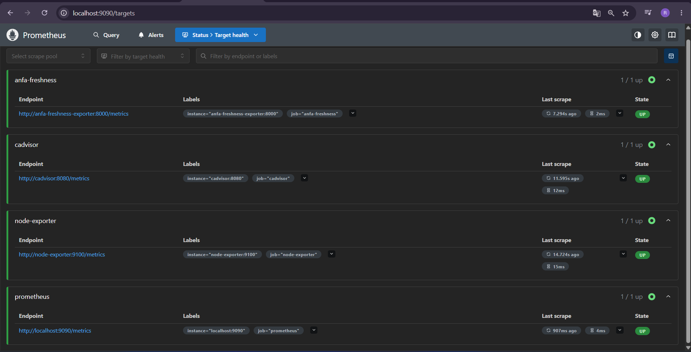
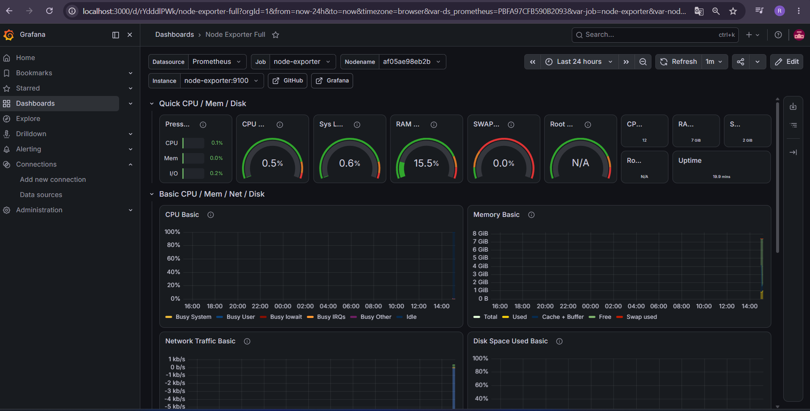
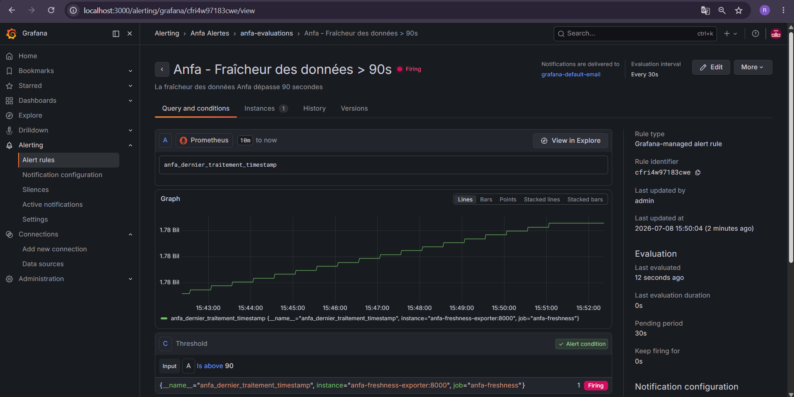

# Rendu — Séance 9

**Nom et prénom :** DAKOU Koudjo  
**Identifiant GitHub :** JohnnyDak  
**Date de soumission :** 08/07/2026

---

## Résumé de la séance

J’ai déployé une stack de monitoring complète (Prometheus + Grafana + Node Exporter + cAdvisor) et instrumenté une métrique métier : la fraîcheur des données Anfa. Un exportateur custom expose l’horodatage du dernier traitement réussi. J’ai construit un dashboard Grafana avec une jauge de fraîcheur, configuré une alerte sur le seuil de 90 secondes, puis simulé une panne silencieuse (création d’un fichier sentinelle) qui a déclenché l’alerte et permis de la visualiser en temps réel.

---

## Étapes principales

1. Déploiement de Prometheus, Node Exporter, cAdvisor, Grafana et d’un exportateur métier custom (fraîcheur des données Anfa).
2. Exploration des cibles Prometheus (4 cibles UP) et premières requêtes PromQL (`time() - anfa_dernier_traitement_timestamp`).
3. Import du dashboard "Node Exporter Full" (ID 1860) et construction d’un panneau custom (jauge de fraîcheur Anfa).
4. Configuration d’une alerte Grafana sur la fraîcheur des données (seuil > 90s, évaluation 10s, pending 30s/1m).
5. Simulation d’une panne silencieuse via un fichier sentinelle (`/tmp/anfa_en_panne`) et observation du passage de l’alerte de `Normal` → `Pending` → `Firing`, puis retour à `Normal` après réparation.

---

## Captures d’écran

### Les 4 cibles Prometheus à l’état UP

### Dashboard "Node Exporter Full" importé

### Alerte à l’état Firing après panne simulée

---

## Réflexion personnelle

Cette séance répond directement à la situation-problème d’Awa (CM) : le pipeline peut être « vivant » (tous les conteneurs tournent, CPU/RAM normales) mais ne plus produire de résultats frais. La métrique de fraîcheur (`time() - anfa_dernier_traitement_timestamp`) permet de détecter ce comportement silencieux. Contrairement aux métriques systèmes (CPU, RAM, statut des conteneurs) qui indiquent seulement si les services tournent, la fraîcheur mesure la **qualité fonctionnelle** du pipeline. C’est une métrique métier, pas une métrique technique. Sans elle, l’incident serait passé inaperçu jusqu’à ce qu’un utilisateur se plaigne.

---

## Difficultés rencontrées

- **Le graphique en dent de scie n’apparaissait pas immédiatement** : j’ai dû vérifier que la plage de temps dans Grafana était bien réglée sur les dernières minutes (`Last 5 minutes`).
- **La jauge restait vide** : j’ai d’abord sélectionné `Stat` pour voir la valeur numérique, puis basculé sur `Gauge` pour la visualisation finale.
- **L’alerte restait en `Firing` après réparation** : j’ai attendu le temps du `Pending period` (1 minute) pour que Grafana vérifie que la condition était bien revenue à la normale avant de désactiver l’alerte.

---

**Fin du rendu.**