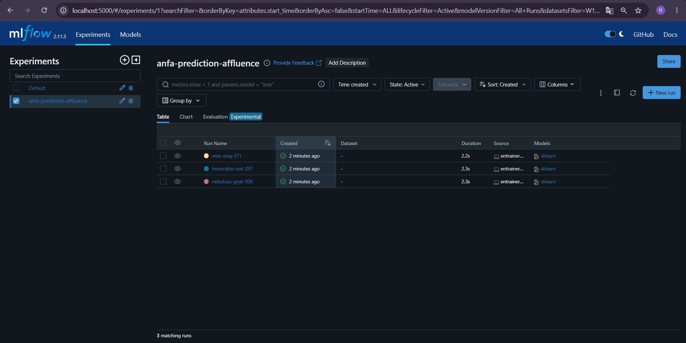
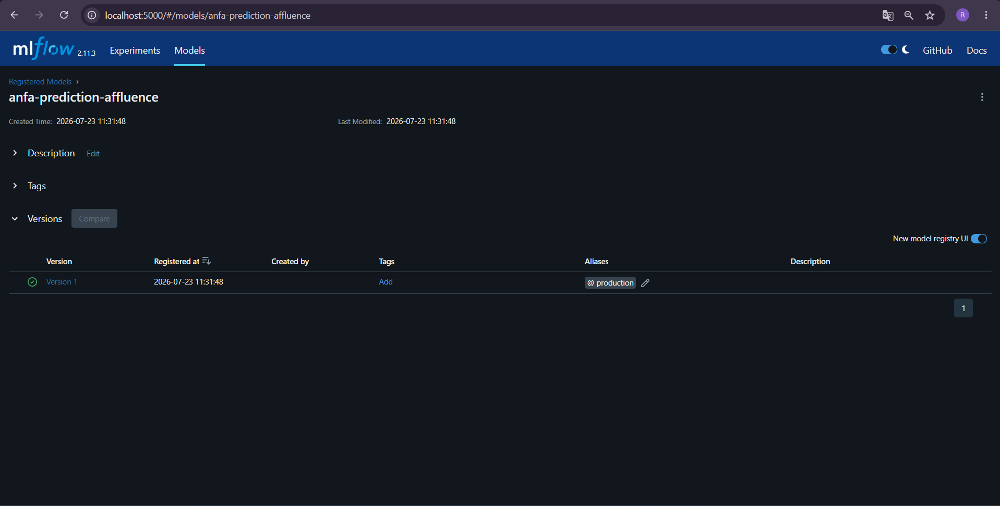

# Rendu — Séance 10

**Nom et prénom :** DAKOU Koudjo  
**Identifiant GitHub :** JohnnyDak  
**Date de soumission :** 23/07/2026

## Résumé de la séance

J’ai déployé un serveur MLflow Tracking, entraîné 3 versions d’un modèle de prédiction d’affluence par ligne, comparé les runs dans l’interface MLflow, enregistré la meilleure version dans le Model Registry et ajouté l’alias `@production`. J’ai également rédigé une fiche de conformité pour un jeu de données sensible d’Anfa.

## Étapes principales

1. Déploiement du serveur MLflow avec Docker Compose.
2. Génération d’un dataset synthétique d’affluence (~3 240 lignes).
3. Entraînement de 3 modèles Random Forest avec tracking des paramètres et métriques.
4. Comparaison des runs dans l’UI MLflow.
5. Enregistrement du meilleur modèle dans le Registry et ajout de l’alias `@production`.

## Captures d’écran

### Tableau des 3 runs dans l’UI MLflow

### Modèle enregistré avec l’alias @production

## Réflexion personnelle

MLflow apporte une traçabilité essentielle au cycle de vie des modèles : chaque expérimentation est datée, paramétrée et reproductible. Le Model Registry permet de gérer les versions en production de manière centralisée, évitant les fichiers de modèles éparpillés. L’alias `@production` remplace avantageusement les anciens stages et permet un chargement automatique de la bonne version par les applications.

## Difficultés rencontrées

- **Python 3.14 incompatible avec numpy** : j’ai exécuté les scripts d’entraînement directement depuis le conteneur MLflow (Python 3.11) pour contourner le problème.
- **Artifacts non visibles dans l’UI** : les premiers runs n’ont pas enregistré les modèles ; j’ai relancé un entraînement et ajouté l’alias `@production` pour finaliser.

---

**Fin du rendu.**